# SC-300: Certified Kubernetes Security

Following this Udemy course: <https://talend.udemy.com/course/sc-300-course-microsoft-identity-and-access-administrator/learn/lecture/24854878#overview>

# Tips

//TODO

# Resume

**ATTN:** Do not forget to cancel the trial MS 365 account so you don't get charged 99$ !!

## Introduction

- A foundation of AD domains, RAS, DMZ and virtualization, and MS Azure:

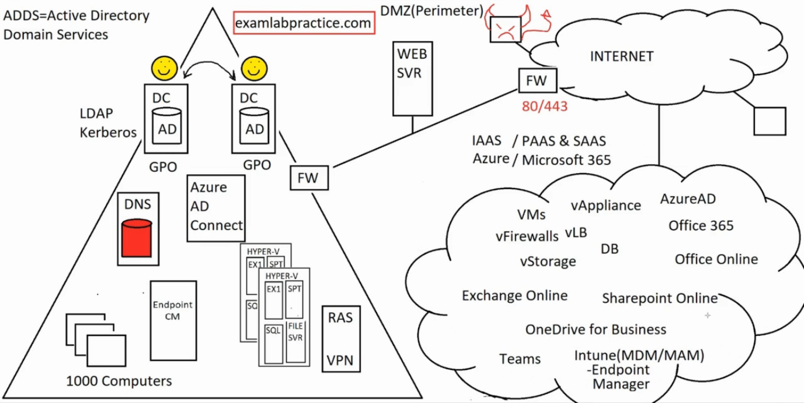*

- Centralization is why domains are important (managing all clients centrally), in addition to security.
- `GPO`: Group Policy Object, a virtual collection of policy objects.
- `LDAP` vs `Kerberos`: Kerberos is the authentication protocol whereas LDAP is for AD domains central info.
- `RAS`: Remote Access Server, the MS way of a VPN.
- `DMZ`: Demilitarized Zone.
- `SCCM`: System Center Configuration Manager, is used to control all devices centrally, now called `Endpoint CM`.
- Virtualization came with VmWare early 2000, whereas Hypervisors were there in 1970s !!
- `Hyper-V` is the MS virtualization solution. Checkpoints in Hyper-V are like snapshots.
- `IAAS` / `SAAS` & `PAAS` are translatate to Azure / Microsoft 365  in the MS Cloud Services world
- `AzureAD` is the directory service and is different that ADDS (is more web-based)

- How to create a trial account in MS 365:

  - Here: <https://www.microsoft.com/en-us/microsoft-365/enterprise/office-365-e5>
  - After that, go to the Azure Portal, AAD and click on "Licenses" then activate the "ENTERPRISE MOBILITY + SECURITY E5" free trial.

## Setup a practice lab

- Download a Windows 10 Trial ISO - Enterprise: <https://info.microsoft.com/ww-landing-windows-10-enterprise.html>

- Download a Windows Server 2019 Trial ISO - Enterprise: <https://info.microsoft.com/ww-landing-windows-server-2019.html>

- Create a Virtual Switch in Hyper-V of type "External". You might face this issue on Windows 10: https://learn.microsoft.com/en-us/answers/questions/746205/hyper-v-not-able-to-add-new-virtual-switch

- Create a Virtual Machine in Hyper-V called "BNN-CL1-Windows-10", you can do so by clicking on "New" > "Virtual Machine" then following the instructions on the wizard:

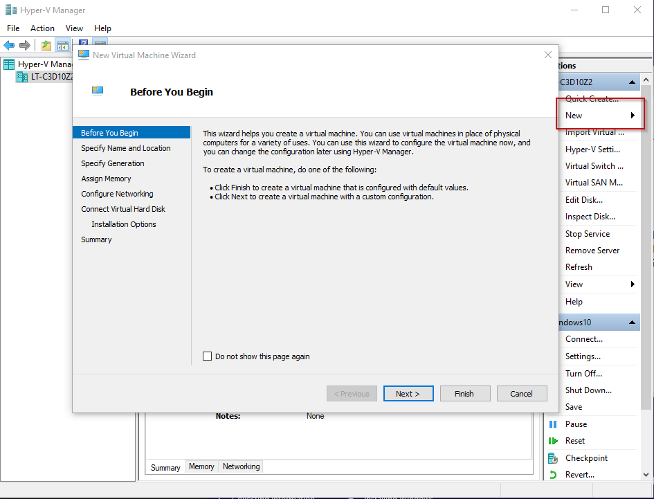

- Notes:

  - If asked, make sure to set the OS to "Windows 10 Enterprise".
  - When prompted for a MS email address, you can put anyone (not a MS one) to create a local account instead.
  - When the new Virtual Machine boots up, go to "Control Panel" > "System" > "Advanced System and Settings" > "Computer Name" and click on "Change" to change the Virtual Machine name to "BNN-CL1":

  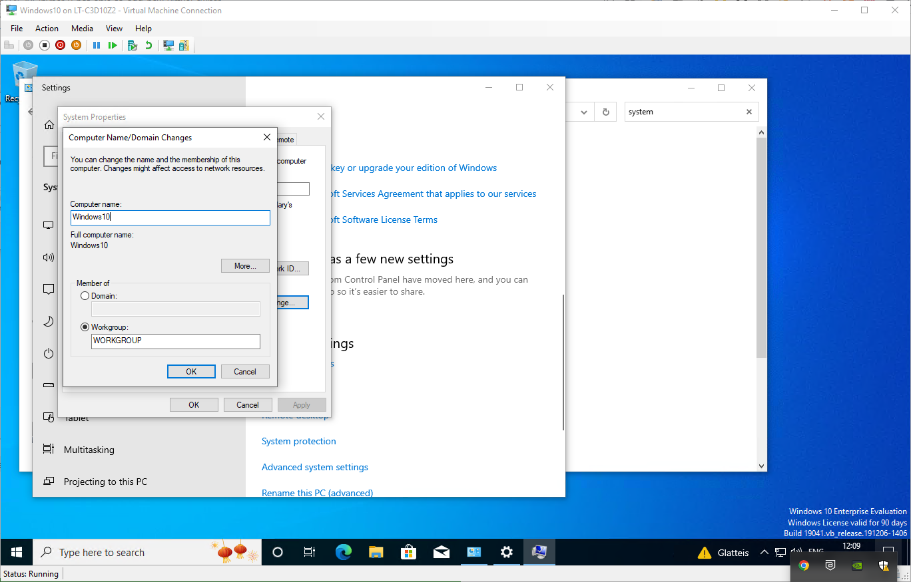

- Similarly, create a Virtual Machine in Hyper-V called "BNN-DC1-Server-2019".

- Notes:

  - If asked, make sure to set the OS to "Windows Server 2019 Datacenter (Desktop Experience)".
  - The Administrator password must satisfy certain complexity requirement.

- Before installing Active Directory, do this on the Server 2019 VM:

  - From the "Server Manager" > "Local Server" click on "Computer Name" and change it to "BNN-DC1".
  - Click on "IPv4 address assgigned by DHCP, IPv6 enabled", right-click on "Ethernet" > "Properties" then disable IPv6 and set the DNS server address to the host IP address because the DC will need to point to itself for DNS so it can register its records:

  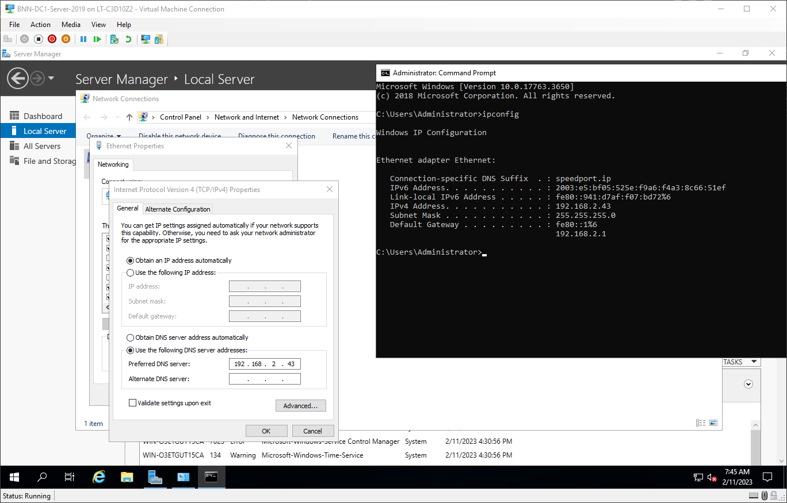

- Then, to install Active Directory, continue on the Server 2019 VM:

  - From the "Server Manager" > "Manage", click on "Add Roles and Features", click "Next" 3 times, check the "Active Directory Domain Services" role and click "Next" and "Finish":

  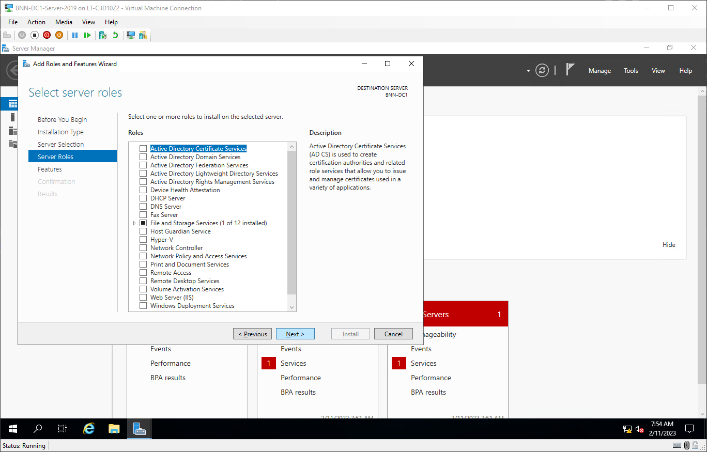

  - After that, tap on the warning sign near "Manage" and click on "Promote this server to a domain controller":

  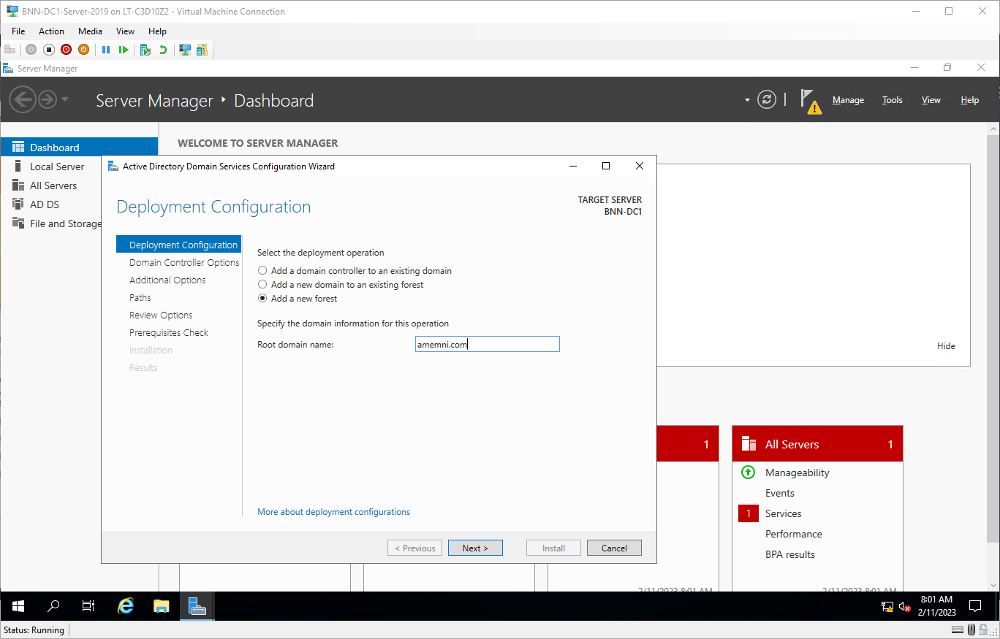

  - Then, basically click "Next" till the end and finally "Install".

- Now we want to join our Windows 10 VM to the "BNN-DC1" domain, continue on the Windows 10 VM:

  - Like done on the Server 2019 VM, disable IPv6 and set the DNS server address to the Server 2019 host IP address.
  - Go to "Control Panel" > "System", click on "Advanced System Settings" > "Computer Name", click "Change" and choose "Domain" under "Member of" with setting the domain name:

  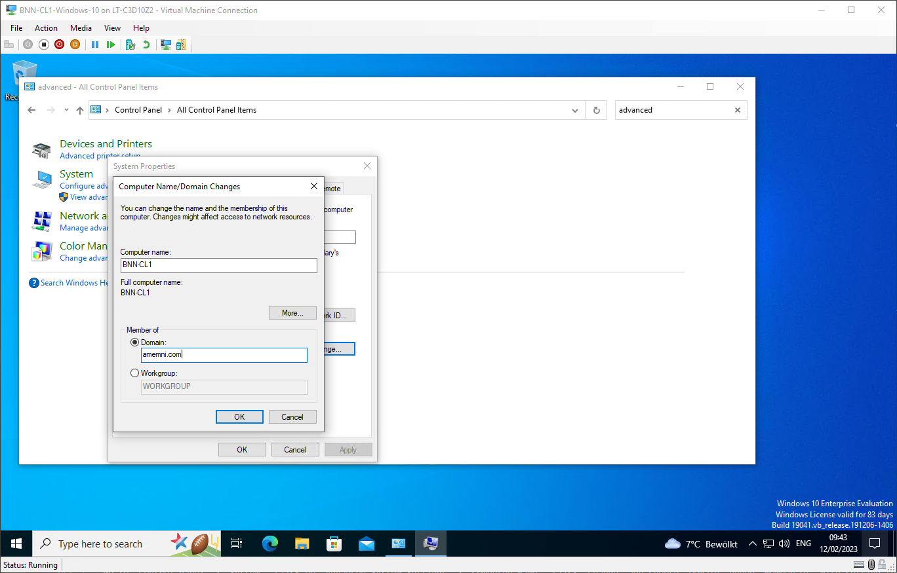

  - After the WIndows VM reboots, you should be able login via a user of the domain (like 'amemni\administrator') and not just the local user.

## Implementing the initial configuration of Azure Active Directory

- In MS 365 Services, users and groups are stored in Azure AD => same DS.
- E.g: if you create users in https://portal.azure.com/ and switch to https://portal.microsoft.com/, you will see them there as well.

- Azure AD directory roles:

  - There are Azure AD and MS 365-focused roles.
  - Issues with GBAC (Group-based, from ADDS) in contrast to RBAC:
    - With assigning permissions to groups, there was nothing that really documented what rights those groups had.
    - You can still check ACLs of every resource or object and see if/which the group had permission to it but you have to do it in all of them.
  - Principle of Least Privilege: giving out the least amount of right but still allowing somebody to do their job.
  - The `Global Administrator` role is the most powerful role one can has in Azure and MS 365.
  - `PIM`: Privileged Identity Management, allows us to achieve JIT (Just-In Time) administration, giving a role temporarily only for a certain amount of time (either by scheduling or a user can request a privilege).
  - Azure AD roles can be visualised using the "Roles and administrators" tab:

  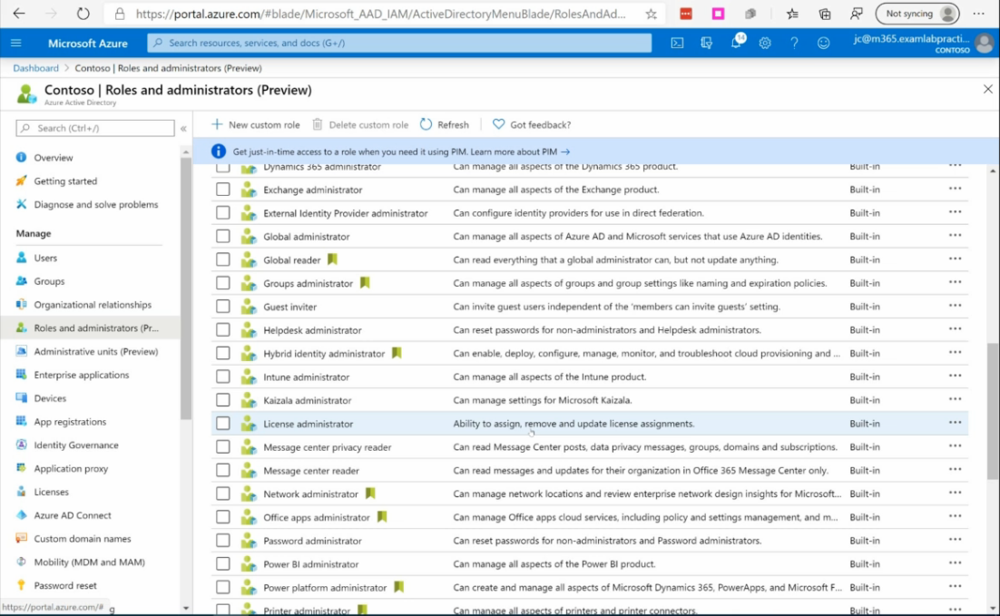

  - Azure AD roles for MS 365 can be visualised from https://portal.microsoft.com/ using the "Permissions" tab:

  

- Azure AD / MS365 custom domains:

  - When first setting up an MS account, the domain name will be like "amemni.onmicrosoft.com".
  - Otherwise, one has to create a custom domain and must prove he owns the domain name (a TXT or MX DNS records in the **public** DNS server or a text file to the domain's website).

- Device registration options:

  - To enable joining devices to Azure AD, go to "Devices" > "Device settings":

  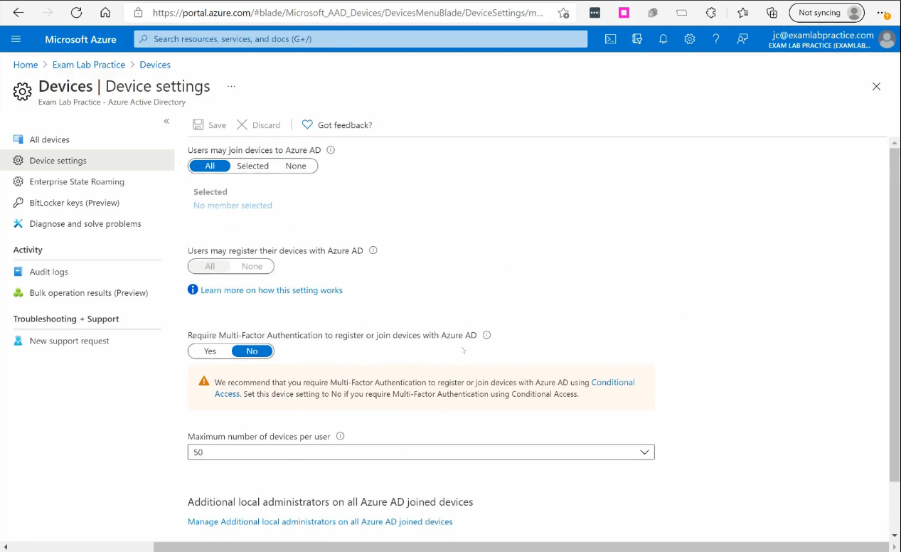

  - To join a device or a computer to Azure AD, go to "Settings" > "Accounts" > "Access work or school", click "Connect" and put in your MS account credentials:

  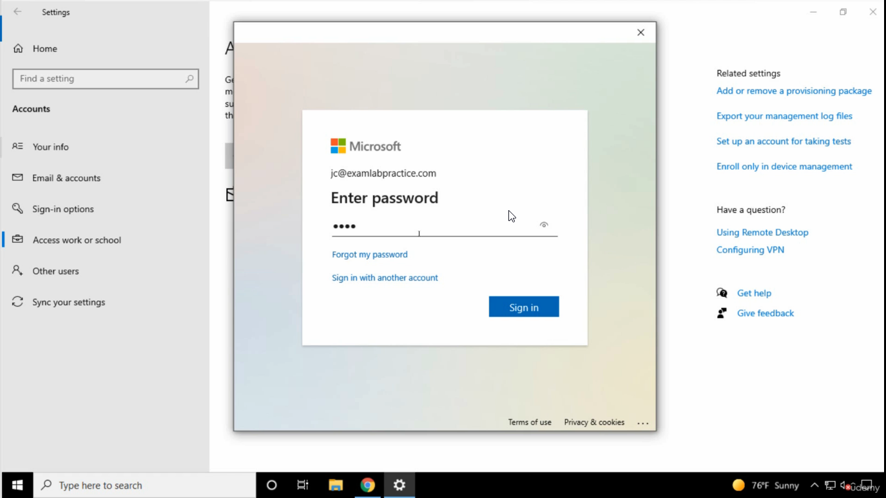

  - Go back to Azure AD and you should see the new computer under "Devices":

  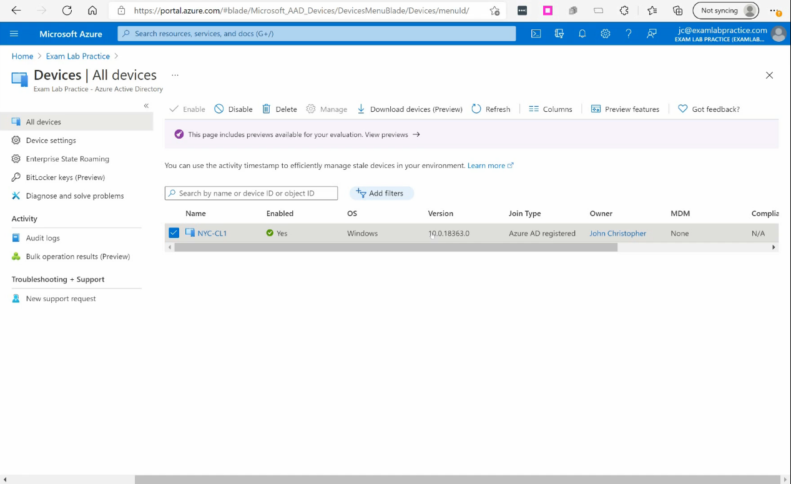

  - Alternatively, one can use the MS Intune endpoint manager with Autopilot profiles to have the computer auto-register itself. GPOs then provisionning packages are other options.

- Administrative units:

  - It's a container for Azure AD resources, can contain only users and groups.
  - In contrast to OUs in ADDS, an object can only be part of a single OU. AUs restrict permissions to any portion of your org.
  - An Azure AD Premium license is required for each AU administrator, and an Azure AD free license for members.
  - In the following example, we create an AU called "New York" and add few users and groups as members:

  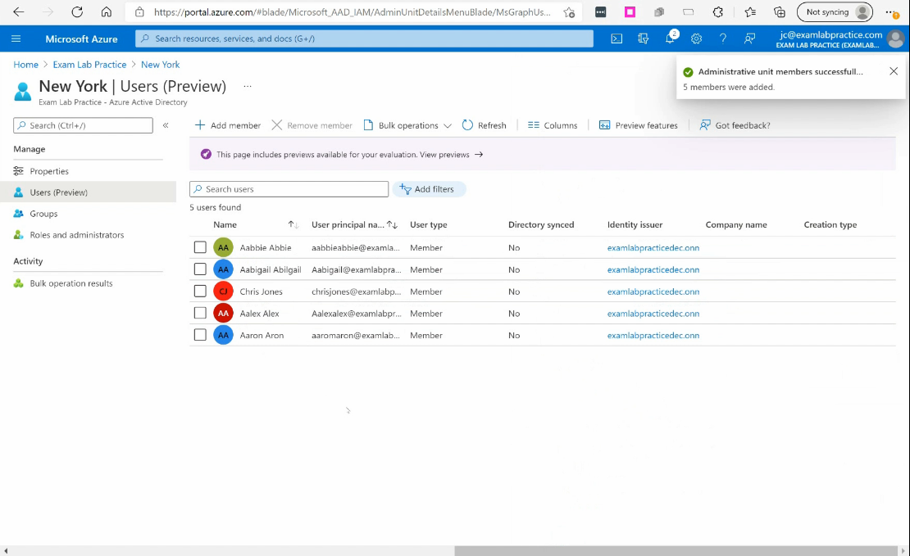

  - Then, via the "Roles and administrators" tab, we can select one of the users and assign one of the administrative roles to him/her **only for the scope of the AU**:

  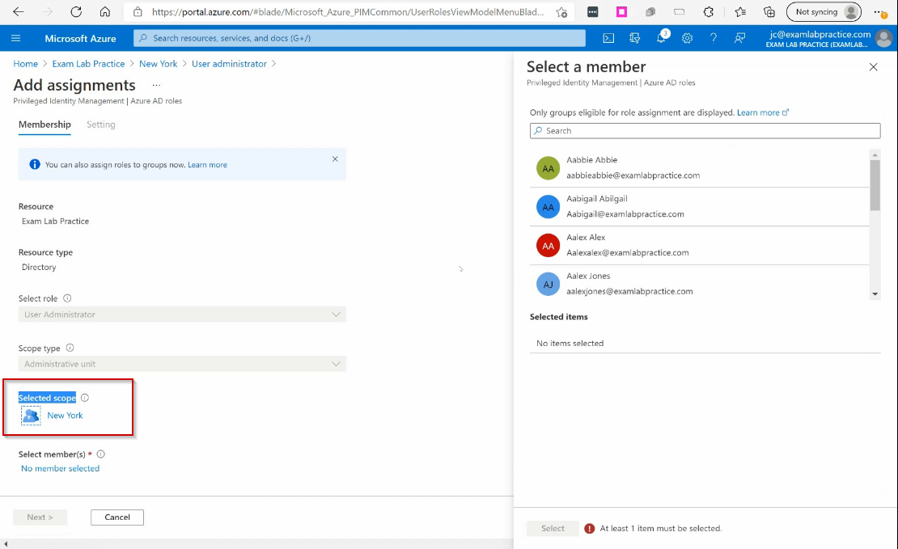

  - Via the "Bulk operation results", it's also possible to manage this at scale via a CSV file and Powershell.

- Tenant-wide settings:

  - An Azure tenant is an instance of Azure AD that users, groups, passwords ..etc are being managed through.
  - Tab "Licenses" is for licenses available and which can be associated to users in the tenant.
  - Tab "Branding" is for putting a company log and a sign-in text for whenever someone logs in.
  - Tab "User settings" has some settings like "App registrations" for allowing users to register apps or not, "Administration portal" for allowing users to access the Azure AD admin portal or not, "LinkedIn account connections". Under "External users", you can configure guest users access and invite settings as follows:

  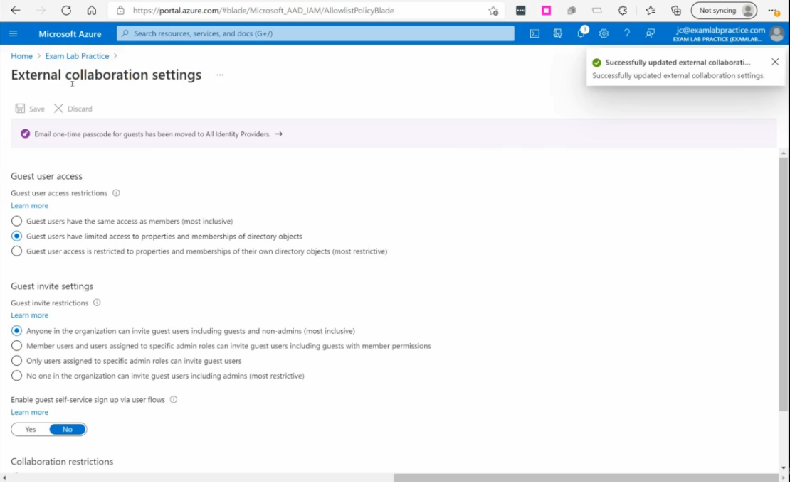

  - Tab "Properties" is for tenant properties like the name, language settings, contact info ..etc. Under "Access management for Azure resources", you can specify who can manage access to Azure subscriptions. Under "Manage security defaults", you can require MFA on certain user accounts like Global Administrators:

  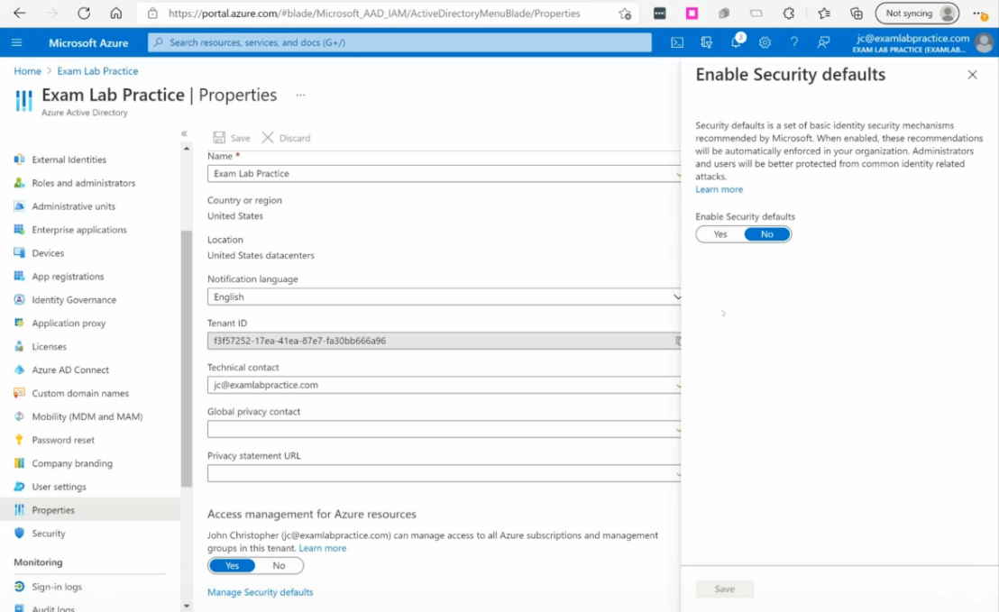

  - In https://portal.microsoft.com, go to "Settings" > "Org settings". Under "Services", you can set application specific settings. Under "Security & privacy", you can set things like the "Password expiration policy", "Self-service password reset", "Privacy profile" ..etc. Under "Organization profile", you can configure themes, log-on banners, a company logo with things like "Custom themese", "Organization information" ..etc.

  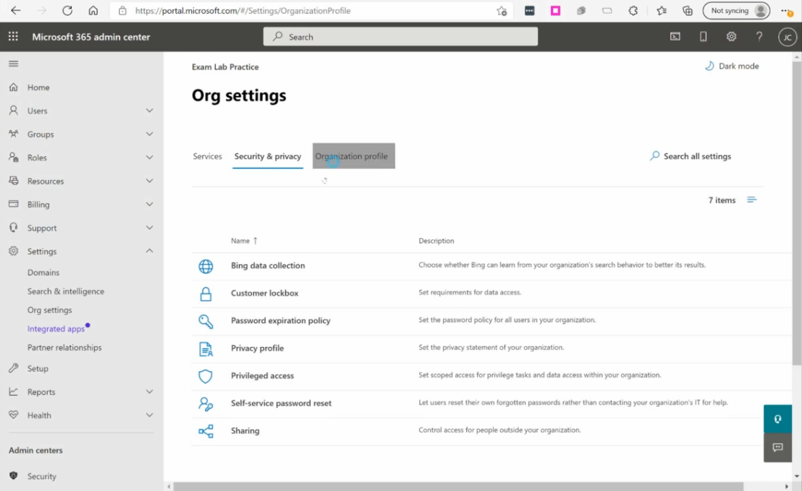

  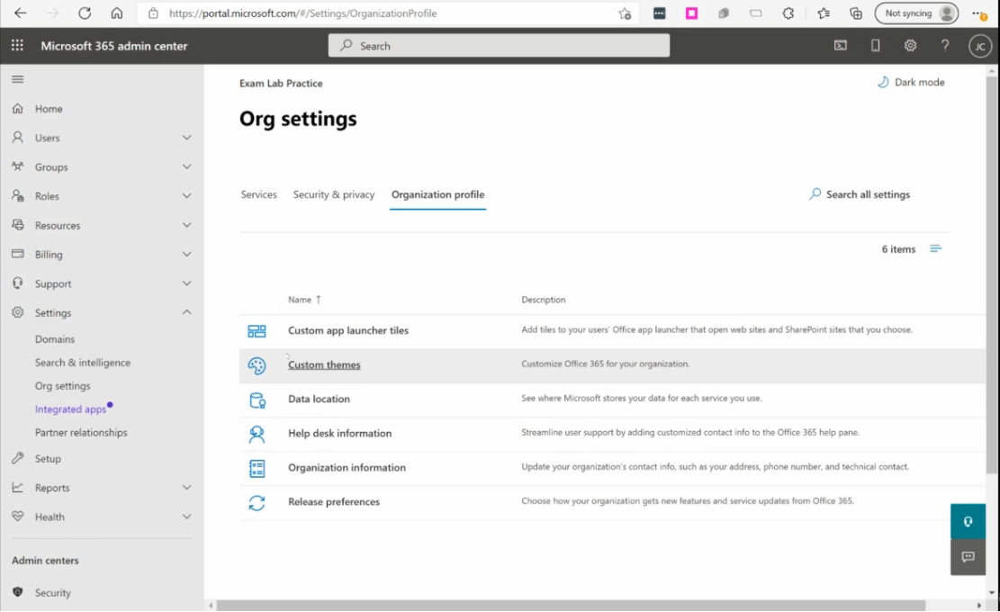

  - In https://portal.microsoft.com, under "Setup", there's a checklist of sign-in and security recommendations/configurations to do:

  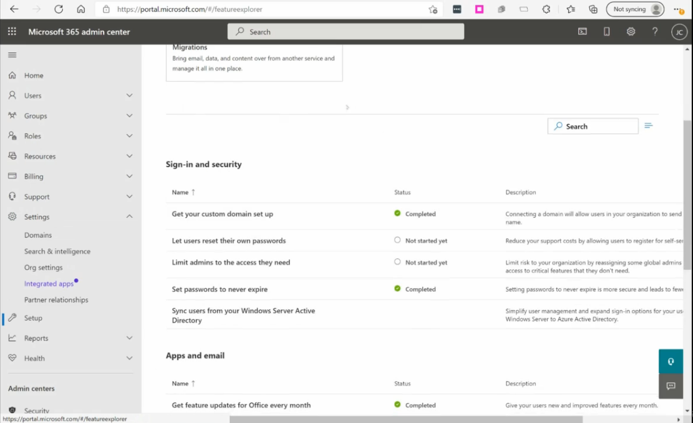
