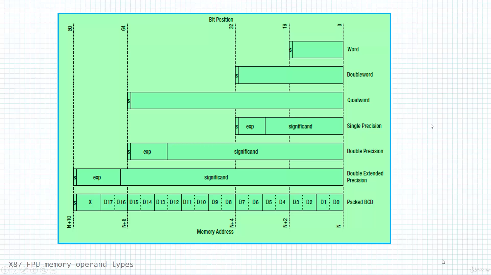

# Assembly

## Why learn Assembly ?

If you want to be among the following, Assembly level programming is a must-know:  
-> Malware Analysts.  
-> Code Exploit Writers.  
-> Reverse Code Engineers.  
-> Shellcoders.  
-> Software Vulnerability Analysts.  
-> Bug Hunters.  
-> Virus Writers.  

Read: <https://www.quora.com/Is-assembly-level-programming-necessary-to-learn-ethical-hacking>

## Notes

### General

- Registers in the IA-32 architecture ?
//TODO

- But wait, what CPU architecures are there ?

- Mike says C is an imperative statically-typed langage that was invented by .. bla bla. What does it mean ?
  - First, **dynamically-typed** languages perform type checking at runtime, while **statically-typed** languages perform type checking at compile time.
  - Second, With imperative programming, you tell the compiler what you want to happen, step by step, while With declarative programming, you write code that describes what you want, but not necessarily how to get it (declare your desired results, but not the step-by-step).

### Udemy course: x86 Assembly Language Programming From Ground Up

- Section 2 | Getting started
  - Coding: Simple Addition:

  ```asm
  .386
  .model flat
  .code
  start PROC
    mov eax,213
    add eax,432
  
    ret
  start endp
  end  start
  ```

- Section 3 | Evolution of Intel processes
  - Comparison table:

  | Name | Year | Transistors | Mhz |
  | ---- | ---- | ----------- | --- |
  | 8086 | 1978 | 29K | 5-10 |
  | 386 | 1985 | 275K | 16-33 |
  | Pentium 4E | 2004 | 125K | 2800-3800 |
  | Core 2 | 2006 | 291M | 1060-3333 |
  | Core i7 | 2008 | 731M | 1060-4400 |

  - Von Neumann architecture:

  ```
  ┌─────┐   Data & Instructions bus   ┌────────┐  
  │ CPU │<--------------------------->│ Memory │  
  └─────┘                             └────────┘  
  ```

  Harvard architecture:

  ```
  ┌─────┐   Data bus           ┌────────┐  
  │     │<-------------------->│        │  
  │ CPU │   Instructions bus   │ Memory │  
  │     │<-------------------->│        │  
  └─────┘                      └────────┘  
  ```

- Section 4 | The computing device
  - The computer stack:

  ```
  ┌─────────────────────────────────────────────────────────────────────────────────┐
  │ Applications/OS                                        Windows, Android, mbedOS │
  └─────────────────────────────────────────────────────────────────────────────────┘
  ┌─────────────────────────────────────────────────────────────────────────────────┐
  │ Programming language                                               C, C++, Java │
  └─────────────────────────────────────────────────────────────────────────────────┘
  ┌─────────────────────────────────────────────────────────────────────────────────┐
  │ Instruction set architecture (ISA)                         MOV RO, R1, LDR, BEQ │
  └─────────────────────────────────────────────────────────────────────────────────┘
  ┌─────────────────────────────────────────────────────────────────────────────────┐
  │ Microarchitecture                                                               │
  └─────────────────────────────────────────────────────────────────────────────────┘
  ┌─────────────────────────────────────────────────────────────────────────────────┐
  │ Gates                                                                           │
  └─────────────────────────────────────────────────────────────────────────────────┘
  ┌─────────────────────────────────────────────────────────────────────────────────┐
  │ Transistors                                                                     │
  └─────────────────────────────────────────────────────────────────────────────────┘
  ```

- Section 5 | The programming model
  - Basic x86 Microcomputer design:
  

    - Note: CPU clock speed might be several GHZs, whereas access to memory occurs over a system bus running at much slower speed !!

  - x86 Operating modes:
    - Protected mode  
          └───────── Virtual - 8060 mode
    - Real - Address mode
    - System management mode

  - Overview of the x86 registers:

  ```
    32 bit general purpose registers                        16 bit segment registers
  ┌───────────────┐      ┌───────────────┐                ┌─────────┐      ┌─────────┐                 
  │      EAX      │      │      EBP      │                │   CS    │      │   EBP   │  
  ┝───────────────┥      ┝───────────────┥                ┝─────────┥      ┝─────────┥
  │      EBX      │      │      ESP      │                │   SS    │      │   EBP   │  
  ┝───────────────┥      ┝───────────────┥                ┝─────────┥      ┝─────────┥
  │      ECX      │      │      ESI      │                │   DS    │      │   EBP   │  
  ┝───────────────┥      ┝───────────────┥                └─────────┘      └─────────┘
  │      EDX      │      │      EDI      │ 
  └───────────────┘      └───────────────┘

  ┌───────────────┐
  │     EFLAGS    │
  ┝───────────────┥
  │     EIP       │ 
  └───────────────┘
  ```

  - In 8060, 80386 (32 bits) or Pentium 4 (x64) architecture, registers are similar (to be backwards-compatible) but prefixed with "E" (e.g: EAX) if they are 32 bits or with "R" (e.g: RAX) if they are 64 bits.

  - Coding: One register to rule them all:
  
  ```asm
  ;------------------x86-64bit------------------
  ;.code
  ;main proc
  ;  mov rax,2
  ;  mov rbx,3
  ;  mov rcx,4
  ;  ret
  ;main endp
  ;end

  ;------------------x86-32bit------------------
  ;.386
  ;.model flat
  ;.code
  ;
  ;main proc
  ;  mov eax,2
  ;  mov ebx,3
  ;  mov ecx,4
  ;  ret
  ;main endp
  ;end main

  ;------------------16bit------------------
  .386
  .model flat
  .code

  main proc
      mov ax,2
      mov bx,3
      mov cx,4
      ret
  main endp
  end  main
  ```

  - Overview of x86 Flags:
    - Control flags: control CPU operations
    - Status flags: reflect outcome of arithmetic and logical operations performed by CPU  
          └───────── Overflow (OF)  
          └───────── Sign (SF)  
          └───────── Zero (ZF)  
          └───────── Carry (CF)  
          └───────── Parity (PF)  
          └───────── Auxiliary Carry (AC)  

  - Overview of the Floating Point Unit:
    - MMX registers: 8 64-bit registers, for advanced multimedia and communication applications, support specialized instructions called SIMD (Single-instruction, Multiple-data)
    - XMM registers: 8 128-bit registers
    - FPU (Floating Point Unit): performs high-speed floating-point arithmetic
    - FPU registers:
    
    - X87 FPU memory operand types:
    

  - Overview of x86 Memory models:
    - Address modes:
    
    - Segmented memory model:
    
    - Flat memory model:
    

## TODOs

0. Finish the `Assembly - Basic Syntax` Tutorialspoint course and the `C/C++ Programming | In One Video` Youtube videos.
1. Finish the `x86 Assembly Language Programming From Ground Up` Udemy course.
2. Finish the `Reverse Engineering with Radare 2` Udemy course.
3. Practice a bit at:

- <https://www.root-me.org/en/Challenges/>

## Resources

- Quick refreshers about C and CPP:
  - [C Programming | In One Video](https://www.youtube.com/watch?v=3lQEunpmtRA&ab_channel=MikeDane)
  - [C++ Programming | In One Video](https://www.youtube.com/watch?v=raZSmcariyU&t=1595s&ab_channel=MikeDane)

- Tutorialspoint just gets to the point:
  - [Assembly - Basic Syntax](https://www.tutorialspoint.com/assembly_programming/assembly_basic_syntax.htm)

- [SecurityTube](http://www.securitytube.net/), still in 2021 ?

- Udemy courses are the best:
  - [x86 Assembly Language Programming From Ground Up](https://www.udemy.com/course/x86-assembly-programming-from-ground-uptm/)
  - [Reverse Engineering with Radare 2](https://www.udemy.com/course/re-radare2/)
