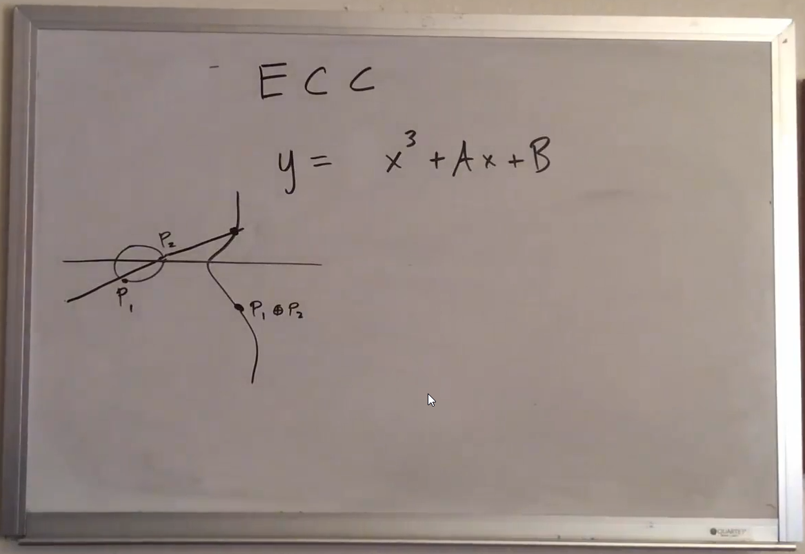

# Crypto

### Why learn Cryptography ?

//TODO

## Notes

### Udemy course: Master Mathematical Cryptography 2020: Crack Any Code

- Section 2 | Number theory lectures that might help
  - Introduction to congruences:

  ```matlab
  a ≡ b (mod n) iff n | (a - b)
  ```

  - Equivalence classes:

  ```matlab
  S := { a - nq | q ∈ ZZ } = [a]

  Let c ∈ ZZ, let a ≡ b (mod n)
  a + c ≡ b + c (mod n)
  a * c ≡ b * c (mod n)
  ```

  - Introduction to linear congruences:

  ```matlab
  Let c ∈ ZZ, let a ≡ b (mod n)
  a * c ≡ b * c (mod n) => a ≡ b (mod n / (c, n))

  Let k >= 0
  a ≡ b (mod n) => a^k ≡ b^k (mod n)
  ```

  - Systems of residues:

    - Definition: a set of integers such as every integer is congruent to modular m to exactly one of this set

  ```matlab
  If {r1, r2, r3, .. rn} is a complete system of residues (mod n)
  and (a, n) = 1
  then {a * r1, a * r2, r3, .. a * rn} is a complete system of residues (mod n)
  ```

  - Linear congruences:

  ```matlab
  If a * x ≡ b (mod n)
  and (a, n) | b
  then we have a solution
  ```

  - Euclidian algorithm:

  ```matlab
  a = b * q1 + r1 with 0 <= r1 < b
  b = r1 * q2 + r2 with 0 <= r2 <= r1 < b
  r1 = r2 * q2 + r3 with 0 <= r3 <= r2 <= r1 < b
  ...
  rn = rn+1 * qn+1 + rn+2
  rn+1 = rn+2 * qn+2

  Then gcd (a, b) = rn+2
  ```

  - Extended euclidian algorithm:

  ```matlab
  gcd (a, b) = a * x + b * y

  121 = 88 * 1 + 33
  88 = 33 * 2 + 22
  33 = 22 * 1 + 11

  => 11 = 33 - 1 * (88 - 33 * 2)
        = 3 * 33 - 88

  => gcd (121, 88) = 11
  ```

  - Solving the multiplicative inverse:

  ```matlab
  5 * x ≡ 1 (mod 7)

  Using the Euclidian algorithm
  => 1 = 3 * 5 - 2 * 7
  => 1 ≡ 3 * 5 (mod 7)
  => 3 * 5 * x ≡ 3 * 5 (mod 7)

  Then x ≡ 3 (mod 7) is the solution
  ```

  - Euler's generalization of Fermat's little thoerem:

  ```matlab
  φ(n) = |{ x | (x, n) = 1 , 1 <= x < n }|

  Let (a, n) = 1 then
  a ^ φ(n) ≡ 1 (mod n)
  ```

  - Successive squaring:

  ```matlab
  2^5012 (mod 101) ?

  Per Euler's generalisation, 2^100 ≡ 1 (mod 101)
  => 2^5012 ≡ 2^(50*100+12) (mod 101)
            ≡ 2^12 (mod 101)
            ≡ 2^8 * 2^4 (mod 101)
            ≡ 54 * 16 (mod 101)
            ≡ 56 (mod 101)
  ```

  - The Euler-Phi function:

  ```matlab
  A multiplicative function is a function f : ZZ+ -> ZZ+ such that
  if a, b ∈ ZZ+ with (a, b) = 1 then
  F(a*b) = F(a) * F(b)

  The Euler-Phi function is multiplicative (long proof)
  => Let (m, n) = 1, then φ(m*n) = φ(m) * φ(n)

  φ(n) = φ(p1^e1) * .. * φ(pk^ek)
       = (p1^e1 - p1^(e1-1)) * .. * (pk^ek - pk^(ek-1))
       = (p1^(e1-1) * (p1-1)) * .. * (pk^(ek-1) * (pk-1))

  => φ(100) = φ(5^2) * φ(2^2) = 5^(2-1) * (5-1) * 2^(2-1) * (2-1) = 40
  ```

- Section 3 | Old Cryptography
  - Shift cipher:

  ```matlab
  A - 01 <-> 06      Key: add 5
  B - 02 <-> 07
  .
  .
  Z - 25 <-> 05

  E.g: HI <-> MN

  Solve by using letter frequency to decrypt.
  E.g: TMNRSQNTTPRYTT
  => E <-> T ("E" is most frequent character) => Key: add 15
  ```

  - Affine cipher:

  ```matlab
  X -> α * x + β (mod n)     Key: multiply by α
                                  then add β

  Solve by using:
    - letter frequency to decrypt,
    - extended euclidien algorithm
  ```

  - Vigenere cipher:

  ```matlab
  A bloc cipher

    Hel|loW|orl|d    Key: Bob
  + Bob|Bob|Bob|B
  = I...

  Solve by, *if you know the key length*:
    - device your message into blocs of key length,
    - take first letter in each block,
    - then it's just a simple Shift cipher,
    - continue with the next letter in each bloc and so on ..

  Kasiski examination: how do I find key length ?
    - If you find repeated messages, then key length devides the distance between them
  ```

  - Playfair cipher:

  ```matlab
  A bloc cipher

  P   L A Y F  Key: Playfair
  I/J R B C D
  E   G H K M
  N   O Q S T
  U   V W X Z
  (To be able to construct a matrix, we assume I=J)

     CA|ST|LE
  => BY|TN|PG

  How ?
    - For characters forming a rectangle, get opposing corners,
    - For characters on the same line, shift by 1 in the matrix

  Solve by:
    - Assuming the last row will always be "U V W X Z" (less frequent characters)
    - We know that once we use up the ciphertext, we get the alphabet again (not perfectly)
    - We can start evaluating what the rest of the characters are
  ```

- Section 4 | Modern Cryptography
  - The AES Cryptosystem:

  ```matlab
  Succeeds the DES Cryptosystem
  Start with a matrix of bytes (hexadecimal):
  (.. .. .. ..)
  (.. .. .. ..)
  (.. .. .. ..)
  (.. .. .. ..)

  Step 1: byte sub-transformation
    - Using the S-Box table, split each byte on the matrix to 2 pieces then substitute it with a position in the S-Box.
    - The S-Box looks like this:
          0000 0001 0010 0011 0100 ... 1111
    0000   63   7c   77   7b   f2       76
    0001   ca   82   c9   7d   fa       c0
    0010   b7   fd   93   26   36       15
    0011   04   c7   23   c3   18       75
    0100   09   83   2c   1a   1b       84
    ...
    1111  8c   a1   89   0d   bf       16
    - We will end up with a new Matrix.

  Step 2: shift rows
    - (a11 a12 a13 a14) -0->      (a11 a12 a13 a14)
      (a21 a22 a23 a24) -1->  =>  (a24 a21 a22 a23)
      (a31 a32 a33 a34) -2->      (a33 a34 a31 a32)
      (a41 a42 a43 a44) -3->      (a42 a43 a44 a41)

  Step 3: mix-column transformation
    - We multiply this by a matrix, which envolves multiplying polynomials together (with overflows).
    - We multiply bytes by representing them into polynomials, e.g (knowing that X + X = 2X = 0):
    00111001 * 00000101 => (X^5 + X^4 + X^3 + 1) * (X^2 + 1) = X^7 + X^5 + X^6 + X^4 + X^5 + X^3 + X^2 + 1
                                                             = X^7 + X^6 + X^4 + X^3 + X^2 + 1

  Step 4: round-key addition
    - The key, which is a matrix, changes with every round, e.g:
    (.. .. .. ..)    (           )
    (.. .. .. ..)    (           )
    (.. .. .. ..) => (W5 W6 W7 W8)
    (.. .. .. ..)    (           )
     W1 W2 W3 W4
    , with: Wi = Wi-4 ⊕ Wi-1
    , and if i is divisible by 4, then: Wi = Wi-4 ⊕ T(Wi-1)
    E.g: W5 = W1 ⊕ W4
         W6 = W2 ⊕ W5
         W7 = W3 ⊕ W6
         W8 = W4 ⊕ T(W7)
    - What's T ?
     ((a))   (b)            (e ⊕ r(i))
    T((b)) = (c) -(S-Box)-> (   f     )
     ((c))   (d)            (   g     )
     ((d))   (a)            (   h     )
    , where r(i) = 00000010 ^ ((i-4)/4) = X ^ ((i-4)/4)
    E.g:
            (e ⊕ r(8))
    T(W7) = (   f     )
            (   g     )
            (   h     )
    - Finally, what's the round-key addition ?
    It's the XOR addition of our matrix and the new key: (.. .. .. ..)    (           )
                                                         (.. .. .. ..)    (           )
                                                         (.. .. .. ..) ⊕ (W5 W6 W7 W8)
                                                         (.. .. .. ..)    (           )
  ```

  - how to endcrypt/decrypt aes and where to find AES in your computer:

  ```matlab
  How to mutliply Hexadecimals or Polynomials ?
  E.g {57} * {83} = {c1} because
  (X^6 + X^4 + X^2 + X + 1) * (X^7 + X + 1) = X^13 + X^11 + X^9 + X^8 + X^6 + X^5 + X^3 + X^3 + X + 1
  What to do with the overflow ? We calculate its module (X^8 + X^4 + X^3 + X + 1). (special polynomial explained by Abstract algebra)
                                        ... = X^7 + X^6 + 1

  Types of AES cryptosystems:
          | Key length (words) | Block size (words) | Number of rounds
  --------|--------------------|--------------------|-----------------
  AES-128 |       4            |         4          |        10
  AES-192 |       6            |         4          |        12
  AES-256 |       8            |         4          |        14
  ```

  - The RSA Cryptosystem:

  ```matlab
  Founded on the security behind prime number factorisation
  Key: n = p * q
  c ≡ m^e (mod n)
  e ~= 65500, m < n (but if message is longer than n, we split it into blocks !!)
  , where p and q are extremely large prime numbers, and n and e are known
  , m and c are the message and the cipher

  How can we crack if we know p and q ?
  m ≡ c^d (mod n)
  , and d * e ≡ 1 (mod (p-1)*(q-1)) ≡ 1 (mod φ(n))
  => d ≡ e^-1 (mod (p-1)*(q-1))

  m^d and c^e are very large computations, however we're working in mod n and we use successif squaring to compute it efficiently
  ```

  - Elliptic Curve Cryptography:

  ```matlab
  Compared to RSA, it's new, faster, way more efficient (less memory and compute) and more secure

  Let's have y = x^3 + a * x + b
  The idea is, no matter what, if you take any 2 points on an elliptic curve, and you draw a line between them, it's gonna pass a third point, guarenteed.
  ```

  

  ```matlab
  How to encrypt ?
  (x1, y1) ⊕ (x2, y2) = (x3, y3)
  where { x3 = m^2 - x1 - x2, y3 = m * (x1 - x3) - y1, if x1 ≠ x2
        { x3 = m^2 - 2 * x, y3 = m * (x1 - x3) - y1, if x1 = x2, y1 = y2
        { ∞, if x1 = x2, y1 = - y2
  m: point slope => m = (y2 - y1) / (x2 - x1) or m = dy / dx (x1, y1)

  How to decrypt ?
  It's so hard, unless you know K (the number of times you added the point/message to itself).
  ```
