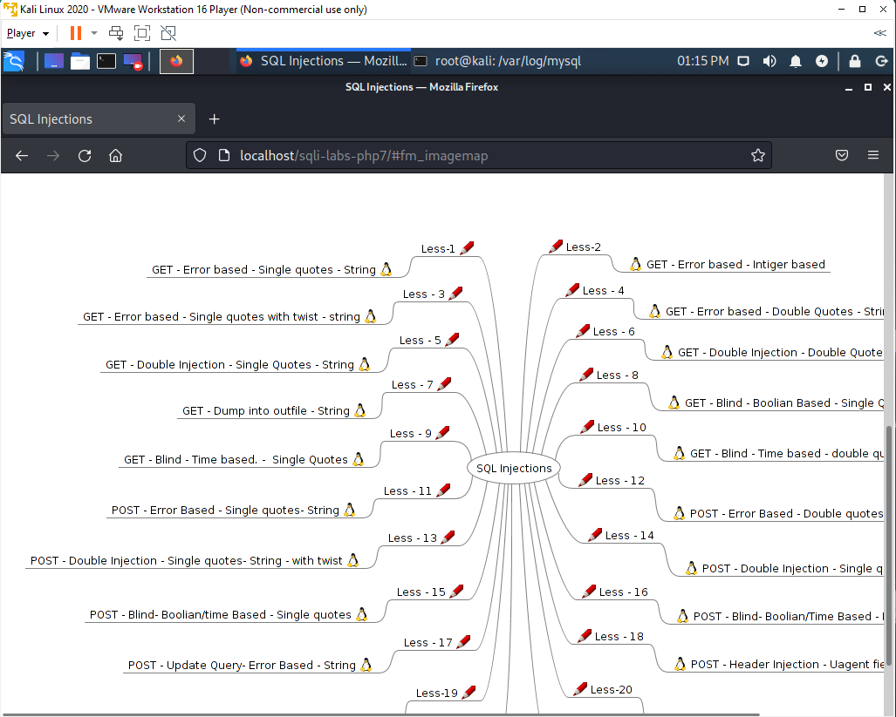

# Crypto

## Intro

//TODO

## Notes

## Udemy course: Kali Linux Web App Pentesting Labs course

Following this Udemy course: <https://talend.udemy.com/course/kali-linux-web-app-pentesting-labs>

### SQLi labs

Steps:

- Download SQLi labs from here: <https://github.com/skyblueee/sqli-labs-php7>

- Setup instructions are in the README

- MySQL setup tips and tricks:

  - Run this to add a new user in MySQL:

  ```sh
  root@kali:~# mysql -u root -p
  Enter password:
  Welcome to the MariaDB monitor.  Commands end with ; or \g.
  Your MariaDB connection id is 38
  Server version: 10.3.22-MariaDB-1-log Debian buildd-unstable

  Copyright (c) 2000, 2018, Oracle, MariaDB Corporation Ab and others.

  Type 'help;' or '\h' for help. Type '\c' to clear the current input statement.

  MariaDB [(none)]> GRANT ALL PRIVILEGES on *.* to 'amemni'@'localhost' IDENTIFIED BY '******';
  Query OK, 0 rows affected (0.001 sec)

  MariaDB [(none)]> Ctrl-C -- exit!
  Aborted
  root@kali:~#
  ```

  - Make sure MySQL logging is enabled:

  ```sh
  root@kali:/etc/mysql/mariadb.conf.d# grep ^general 50-server.cnf
  general_log_file       = /var/log/mysql/mysql.log
  general_log            = 1
  root@kali:/etc/mysql/mariadb.conf.d#
  ```

  - You can access labs from here:

  
